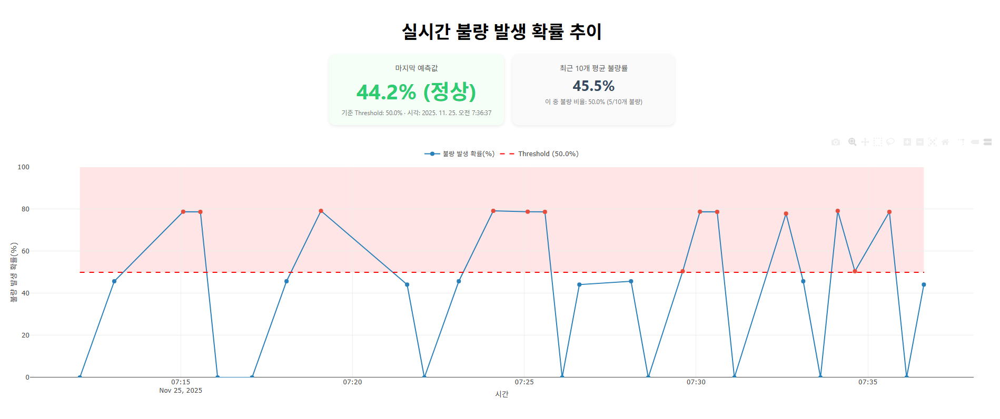

# 🧊 Melting-Tank MLOps
## 실시간 제조 공정 불량 예측 시스템 (Real-time Manufacturing Defect Prediction System)

### 📌 프로젝트 개요
**melting-tank-mlops**는 실제 제조 공정 데이터를 기반으로 *실시간 불량 발생 확률을 예측하고 시각화*하는 엔드-투-엔드(E2E) MLOps 시스템입니다.  
AI 모델 예측, 실시간 시뮬레이터, 대시보드, AWS 클라우드 배포까지 모두 자동화되어 있습니다.

---

## 🚀 주요 기능

### 🔹 1. MES 실시간 데이터 시뮬레이터
- CSV 기반 공정 데이터 스트리밍
- 30초 간격 예측 호출 자동화

### 🔹 2. AI 기반 불량 예측 모델
- LSTM 모델 기반 예측
- threshold 기반 불량/정상 판정
- 예측 결과 저장 및 통계 제공

### 🔹 3. FastAPI 백엔드
- `/predict` : 예측 API  
- `/dashboard/data` : 실시간 데이터 제공  
- `/dashboard` : Plotly.js 대시보드 렌더링  

### 🔹 4. Plotly.js 실시간 대시보드
- 불량 발생 확률(%) 타임라인 그래프  
- KPI 카드(마지막 예측값 / 최근 평균)  
- KST 기준 시간 표시  

### 🔹 5. AWS ECS Fargate 운영환경
- Docker 기반 컨테이너
- ALB(Application Load Balancer) 라우팅
- CloudWatch Logs 기반 실시간 로그 추적

### 🔹 6. GitHub → CodePipeline → ECS 자동 배포
- main 브랜치 push → 자동 Build & Deploy
- buildspec.yml 기반 도커 빌드 & ECR Push

---

## 🏗 아키텍처 개요

```
CSV Simulator  →  FastAPI API →  ECS Fargate →  ALB → Dashboard
                  ↑                                       ↓
            LSTM Model                          Plotly.js Visualization
```

---

## 📁 디렉토리 구조

```
melting-tank-mlops/
├── app/
│   ├── main.py               # FastAPI 진입점
│   ├── model.py              # LSTM 모델 로딩
│   ├── storage.py            # 예측 저장(KST 시간 적용)
│   ├── simulator.py          # MES 시뮬레이터
│   ├── dashboard.py          # 대시보드 라우팅
│   └── static/
│       └── dashboard.html    # Plotly.js 시각화 페이지
│
├── data/
│   └── melting-sensor.csv    # 시뮬레이션용 공정 데이터
│
├── Dockerfile
├── buildspec.yml
├── requirements.txt
└── README.md
```

---

## 🐳 Docker 실행

### 1️⃣ 이미지 빌드
```
docker build -t melting-tank-api .
```

### 2️⃣ 로컬 실행
```
docker run -p 8080:8080 melting-tank-api
```

---

## 📊 대시보드 예시
- 실시간 불량 확률 그래프  
- 임계값(Threshold) 표시  
- 최근 평균 불량률  
- 마지막 예측값 (정상/불량)  



---

## ⚙️ AWS 배포 구조
- ECR 이미지 Push
- ECS Fargate 서비스 1개 + Task 1개 운영
- ALB Listener 라우팅:
  - `/dashboard`
  - `/dashboard/data`
  - `/predict`

---

## 🧪 예측 API 예시

### 요청
```
POST /predict
```

### 응답
```json
{
  "prob_ng": 0.78,
  "label": "NG",
  "timestamp": "2025-11-20 13:48:00"
}
```

---

## 👤 Maintainer
**youneedpython**

---

## 📄 License
This project is licensed under the MIT License.
