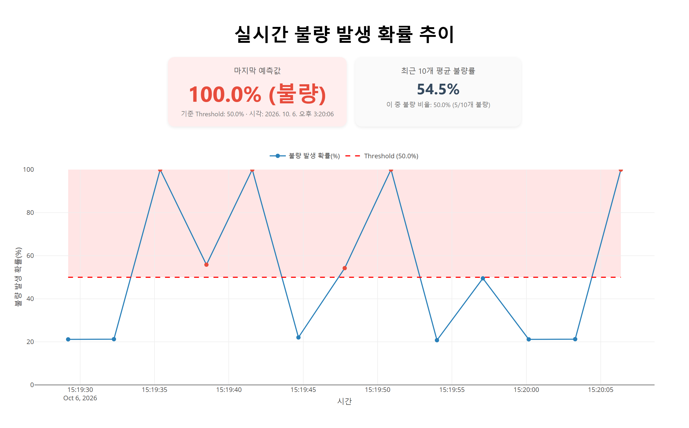
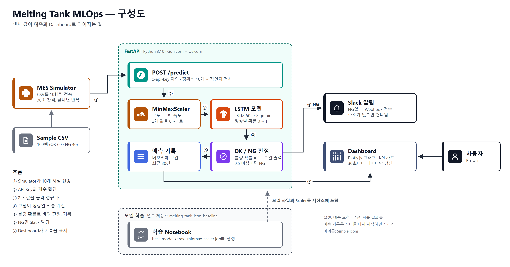
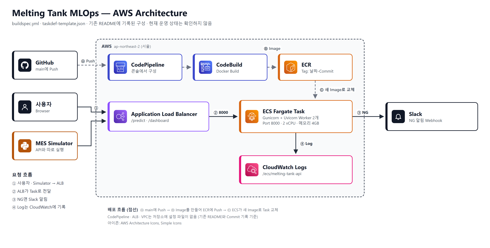

# Melting Tank MLOps

**용해탱크 공정의 센서 값으로 불량 가능성을 예측하고, 그 추이를 Dashboard로 보여 주는 서비스**

최근 10개 시점의 용해 온도와 교반 속도를 보내면 LSTM 모델이 불량 확률을 계산하고, 기준값(Threshold)과 비교해 OK / NG를 판정합니다.
MES 장비를 흉내 낸 Simulator가 주기적으로 데이터를 보내고, Dashboard가 최근 예측 30건의 추이를 그래프로 보여 줍니다.



> 공개 데이터셋으로 만든 학습용 프로젝트입니다. 실제 공정의 품질 판정에 쓸 수 있는 수준으로 검증하지 않았습니다.

| | |
|---|---|
| 화면 | 예측 추이 Dashboard (KPI 카드, Threshold 선, NG 표시) |
| 데이터 | KAMP 용해탱크 AI 데이터셋 (6초 간격 센서 값), 저장소에는 Sample 100행 |
| 모델 | LSTM (입력: 10개 시점 × 온도 · 교반 속도 2개 값) |
| API | FastAPI: 예측, Dashboard, Health Check |
| 배포 | AWS ECS Fargate + CodeBuild (Docker Image를 ECR에 Push) |

**더 읽기**: [Wiki](https://github.com/youneedpython/melting-tank-mlops/wiki) · [사용 영상](#사용-영상) · [모델 학습 Notebook (melting-tank-lstm-baseline)](https://github.com/youneedpython/melting-tank-lstm-baseline)

---

## 사용 영상

Local 환경에서 2026-10-06에 녹화했습니다. 빨리 보이도록 Simulator 전송 간격을 1초, Dashboard 갱신 간격을 2초로 줄였습니다(기본값은 둘 다 30초).

**PC (41초)** — Simulator가 보낸 예측이 쌓이기 시작한 Dashboard → 그래프와 KPI 카드 갱신 → NG 3건 연속 경고 → 그래프에서 값 확인

https://github.com/user-attachments/assets/c9c8da01-f56a-4bc6-a82d-096048fb9ec1

- Dashboard에는 모바일용 화면이 없습니다. 좁은 화면에서는 PC 화면이 축소되어 보입니다.

---

## 주요 기능

### 1. 불량 예측 API

- 센서 값 10개 시점을 받아 불량 확률(0 ~ 1)과 OK / NG 판정을 돌려줍니다.
- 요청에는 온도, 교반 속도, 내용량, 수분 함유량 4개 값을 받지만, 모델은 **온도와 교반 속도 2개만** 사용합니다.
- `x-api-key` Header가 맞지 않으면 `401`을 돌려줍니다.
- 10개가 아닌 개수를 보내면 모델을 실행하지 않고 거절합니다.

### 2. 예측 추이 Dashboard

- 최근 예측 30건을 시간순 그래프로 보여 주고, Threshold를 넘은 점은 빨간색으로 표시합니다.
- KPI 카드 2개: 마지막 예측값과 판정, 최근 10건의 평균과 NG 비율.
- NG가 3건 연속이면 경고를 표시합니다.
- 30초마다 데이터만 다시 불러와 화면이 깜빡이지 않습니다.
- 예측 기록은 메모리에만 보관합니다. 서버를 다시 시작하면 사라집니다.

### 3. MES Simulator

- Sample CSV를 10행씩 끊어 30초 간격으로 예측 API에 보냅니다. 끝까지 보내면 처음부터 반복합니다.
- API 서버와 따로 실행하는 Script입니다. Container를 띄운다고 함께 실행되지는 않습니다.

### 4. NG 알림

- 판정이 NG이면 Slack Webhook으로 알림을 보냅니다.
- `SLACK_WEBHOOK_URL`을 설정하지 않으면 알림을 건너뜁니다.

---

## 예측은 어떻게 동작하나요?

| 단계 | 하는 일 |
|---|---|
| 1. 입력 확인 | 센서 값이 정확히 10개 시점인지 확인 |
| 2. 값 선택 | `MELT_TEMP`, `MOTORSPEED` 2개만 골라 학습 때와 같은 순서로 정렬 |
| 3. 정규화 | 학습 때 저장한 MinMaxScaler로 0 ~ 1 범위로 변환 |
| 4. 예측 | LSTM(50) → Dense(1, Sigmoid) 모델이 **정상일 확률**(0 ~ 1)을 출력 |
| 5. 변환 | 불량 확률 = 1 - 모델 출력 |
| 6. 판정 | 불량 확률이 Threshold(기본 `0.5`) 이상이면 NG, 아니면 OK |
| 7. 기록 | 불량 확률과 시각(KST)을 메모리에 저장, 최근 30건만 유지 |

모델과 Scaler는 서버가 시작할 때 한 번만 읽습니다. 읽지 못하면 서버가 시작되지 않습니다.

학습 Notebook이 Label을 `OK = 1`, `NG = 0`으로 만들었기 때문에 모델 출력은 정상일 확률입니다. 그래서 5단계에서 불량 확률로 바꿉니다.

---

## 구성



| API | 설명 |
|---|---|
| `POST /predict` | 센서 값 10개 시점 → 예측값, 판정, Threshold, Version (`x-api-key` 필요) |
| `GET /dashboard` | Dashboard 화면 |
| `GET /dashboard/data` | Dashboard에 쓰는 지표와 그래프 데이터 |
| `GET /healthz` · `GET /readyz` | 서버 생존 확인, 모델을 읽었는지 확인 |
| `GET /` | 실행 여부와 Version |

요청과 응답 예:

```json
// POST /predict  (readings는 정확히 10개)
{ "readings": [ { "MELT_TEMP": 484, "MOTORSPEED": 137, "MELT_WEIGHT": 691, "INSP": 3.19 } ] }

// 응답
{ "prob_ng": 0.2117, "label": "OK", "threshold": 0.5, "version": "1.0.0" }
```

## AWS 배포



- **Build**: `buildspec.yml`이 Docker Image를 만들어 날짜와 Commit 번호가 들어간 Tag로 ECR에 올립니다.
- **실행**: ECS Fargate Task(2 vCPU, 메모리 4GB)가 Gunicorn + Uvicorn Worker 2개로 `8000`번 Port에서 실행됩니다.
- **Log**: CloudWatch Logs의 `/ecs/melting-tank-api` 그룹에 남습니다.
- **Region**: `ap-northeast-2` (서울)

CodePipeline과 ALB는 AWS 콘솔에서 만든 것으로, 저장소에는 설정 파일이 없습니다. AWS 환경이 지금도 실행 중인지는 확인하지 않았습니다.

## 기술 스택

| 영역 | 기술 |
|---|---|
| API | Python 3.10, FastAPI 0.115, Gunicorn + Uvicorn, Pydantic 2.9 |
| 모델 | TensorFlow 2.20, Keras 3.12, scikit-learn 1.7 |
| Dashboard | Plotly.js (CDN) |
| Infrastructure | Docker, AWS ECR, ECS Fargate, ALB, CloudWatch Logs |
| CI / CD | AWS CodeBuild |

정확한 Version은 `requirements.txt`를 따릅니다.

## 재현 방법

| 항목 | 내용 |
|---|---|
| 모델 파일 | `model/best_model.keras` (LSTM 50 + Dense 1, Parameter 10,651개) |
| Scaler | `artifacts/minmax_scaler.joblib` (`MELT_TEMP` 308 ~ 832, `MOTORSPEED` 0 ~ 1804) |
| 학습 | [melting-tank-lstm-baseline](https://github.com/youneedpython/melting-tank-lstm-baseline)의 Notebook |
| Sample 데이터 | `data/mes_sample_data.csv` (100행: OK 60, NG 40) |
| 판정 방향 확인 | Sample의 NG 40행을 한 행씩 10번 반복해 넣으면 40행 모두 NG로 판정 (2026-10-06) |
| 자동 Test | 없음 |

---

## 시작하기

### 준비

- Python `3.10` 또는 `3.11`
- Docker (Container로 실행할 때)

### 1. API 서버 실행

```bash
pip install -r requirements.txt
API_KEY=my-local-key uvicorn app.main:app --port 8000   # http://localhost:8000
```

Docker로 실행하려면:

```bash
docker build -t melting-tank-api .
docker run -p 8000:8000 -e API_KEY=my-local-key melting-tank-api
```

### 2. Simulator 실행

```bash
# 별도 터미널에서, API 서버와 같은 API_KEY로
API_KEY=my-local-key SIM_INTERVAL_SEC=5 python mes_simulator.py
```

### 3. 확인

`http://localhost:8000/dashboard`를 열면 Simulator가 보낸 예측이 그래프에 쌓입니다.

| 환경변수 | 기본값 | 용도 |
|---|---|---|
| `API_KEY` | 없음 (필수) | `/predict` 인증. 설정하지 않으면 모든 예측 요청이 `401`입니다 |
| `PREDICTION_THRESHOLD` | `0.5` | NG 판정 기준값 |
| `SLACK_WEBHOOK_URL` | 없음 | NG 알림을 보낼 주소 |
| `DASHBOARD_REFRESH_INTERVAL` | `30` | Dashboard 갱신 주기(초) |
| `API_BASE_URL` | `http://localhost:8000` | Simulator가 호출할 API 주소 |
| `SIM_INTERVAL_SEC` | `30` | Simulator 전송 간격(초) |

- 2026-10-06에 Windows 10, Python 3.11에서 `uvicorn`으로 실행해 예측, Simulator, Dashboard 데이터를 확인했습니다.
- Docker 실행은 이번에 다시 확인하지 않았습니다.

---

## 프로젝트 구조

```text
melting-tank-mlops/
├── app/
│   ├── main.py              FastAPI 진입점, 모델 읽기, 예측 API
│   ├── inference.py         입력 정렬, 예측, OK / NG 판정
│   ├── schemas.py           요청 / 응답 형식, 10개 시점 검사
│   ├── dashboard.py         Dashboard 화면과 지표 계산
│   ├── storage.py           최근 예측 30건 보관 (메모리)
│   └── utils.py             정규화, API Key 확인, Slack 알림
├── model/                   학습된 LSTM 모델
├── artifacts/               학습 때 저장한 MinMaxScaler
├── data/                    Simulator용 Sample CSV
├── mes_simulator.py         MES Simulator
├── Dockerfile               실행 Image
├── buildspec.yml            CodeBuild: Image Build, ECR Push
├── taskdef-template.json    ECS Task 정의 Template
├── docs/assets/             README 이미지
└── LICENSE                  MIT License
```
